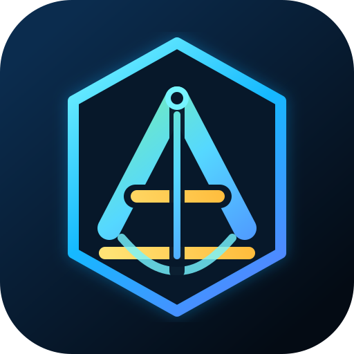
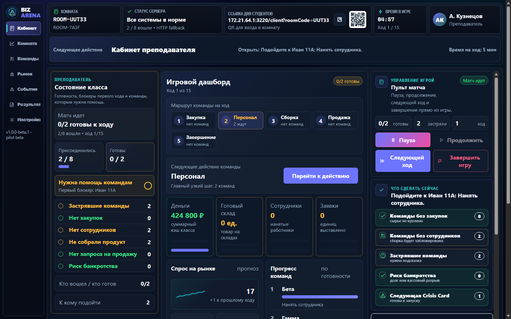
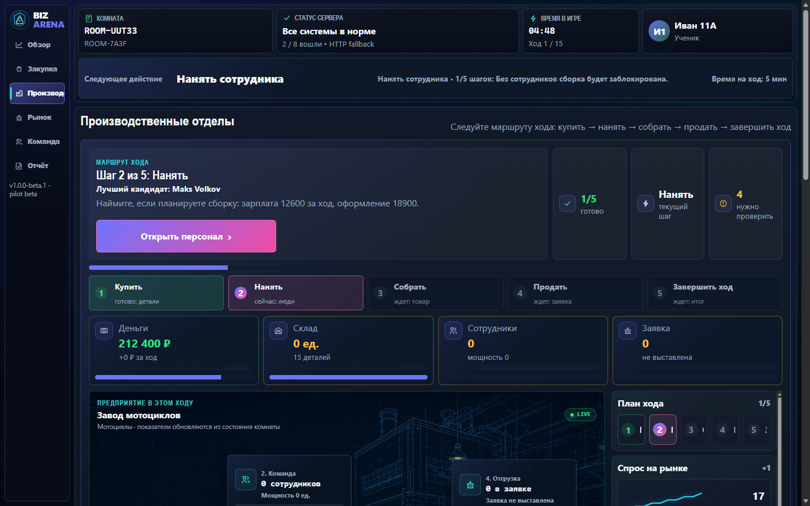

# Biz Arena



[](https://github.com/idiacon/BIZ-ARENA/actions/workflows/ci.yml)

Biz Arena is a competitive, turn-based business simulator for university classrooms. A teacher creates and controls a session, while students independently manage companies inside one shared market and then explain together why different strategies produced different results.

The project is developed for educational use at the Almetyevsk branch of KNRTU-KAI.

## Current Status

- Version: `1.0.0-beta.1`
- Stage: pilot beta and classroom rehearsal
- Capacity target: up to 30 students in one room
- Primary near-term mode: Local Classroom over LAN
- Durable online target: a KAI server or a standard VPS
- Student accounts: not required
- Client delivery: browser, portable Electron app, or Windows installer
- Primary UX target: Windows desktop from `1000x760` through `3440x1440`
- Tablet and phone optimization: after the desktop pilot

Biz Arena remains browser-first internally. The Electron Server and Client applications package the same tested web runtime into a desktop experience; they are not separate game implementations.

## Dual-Role Desktop Interface

The classroom shares one visual system but gives each role a purpose-built workspace:

- **Teacher Operations Center:** dense class monitoring, readiness and blocker signals, market context, help queue, and authoritative turn controls.
- **Student Premium Tycoon:** the same classroom HUD and navigation language around a live 2.5D factory, guided business route, market context, and personal decision tools.
- **One behavior contract:** Full, Standard, and Lite keep every classroom action in the same place while scaling scene assets, motion, and update cost.

| Teacher Operations Center | Student Premium Tycoon |
| --- | --- |
|  |  |

## Classroom Flow

1. The teacher opens `/server`, creates a room, and configures the scenario, difficulty, turn count, and timer.
2. Students open `/client` through a LAN link or QR code and join with a room code, name, and company.
3. The teacher sees readiness, connection status, blockers, help requests, and the authoritative start gate.
4. Every student acts independently during the shared turn.
5. The next turn starts when all students finish, the timer expires, or the teacher ends the turn.
6. The teacher receives the class debrief; each student receives personal results.
7. Completed sessions remain available for teacher review and JSON/CSV export.

## Implemented Features

### Teacher

- Room creation, QR/student link, Network Doctor, and preflight checklist
- Class readiness and start eligibility controlled by server-side rules
- Start, pause, resume, next-turn, finish, and reset controls
- Live cockpit for connected, ready, stuck, inactive, and bankruptcy-risk teams
- Student help-request queue
- Crisis Cards mapped to classroom market events
- Session history, results, replay summary, and exports

### Student

- Guest entry without mandatory registration
- Thin `student-state-v2` API contract that hides teacher and internal room data
- Guided first-turn route: Buy -> Hire -> Assemble -> Sell -> Finish turn
- Teacher-help request with category and optional message
- Reconnect support, WebSocket invalidation, and HTTP polling fallback
- Personal results without teacher-only methodology or other teams' private state

### Simulation

- Shared market, supply and demand, prices, inventory, staff, debt, and contracts
- Factory portfolio covering motorcycles, drones, smartphones, EV scooters, and appliances
- Difficulty presets plus scenario settings
- Research, policies, season goals, market events, and transparent score components
- JSON and SQLite storage with schema migration, recovery, backup, and restore tooling

## Performance Profiles

All profiles keep the same information architecture and controls. They change visual intensity and update frequency, not game rules.

| Profile | Target | Visual behavior |
| --- | --- | --- |
| `Full` | 16 GB RAM / discrete GPU | Complete 2.5D classroom and factory presentation |
| `Standard` | 8 GB RAM | Reduced effects with the same layout and data |
| `Lite` | 6 GB RAM / integrated graphics | No heavy animation, longer polling intervals, simplified rendering |

`Auto` selects a profile, and the user can override it in the interface.

## Quick Start

Requirements: Node.js 20 or newer and npm. CI currently verifies the project on Node.js 24.

```powershell
npm ci
npm run start:server
```

Open the teacher screen:

```text
http://127.0.0.1:3000/server
```

Students use the QR/link shown by the teacher, or open:

```text
http://TEACHER-LAN-IP:3000/client
```

Health checks:

```text
http://127.0.0.1:3000/api/health
http://127.0.0.1:3000/api/meta
```

The Local Classroom screen provides the LAN address, QR code, firewall guidance, and `/api/network/check` diagnostics.

## Deployment Targets

| Target | Status | Persistence |
| --- | --- | --- |
| Local Classroom | Primary pilot path | Local JSON or SQLite |
| KAI server / standard VPS | Primary durable online target | SQLite in a durable data directory |
| Render | Demo and QA only | Free-service filesystem is not treated as durable |
| Oracle profile | Archive / unsupported release path | Templates retained for reference only |
| Cloudflare tunnel | Unsupported | Removed from the active classroom workflow |

Cloud mode runs the same long-lived Node.js server with WebSocket support:

```bash
BIZ_ARENA_DEPLOYMENT=cloud \
BIZ_ARENA_APP_MODE=server \
BIZ_ARENA_STORAGE=sqlite \
BIZ_ARENA_DATA_DIR=/var/lib/bizarena \
BIZ_ARENA_SQLITE_PATH=/var/lib/bizarena/biz-arena.sqlite \
node server.js
```

Teacher registration should be enabled only for the first account and then locked with `BIZ_ARENA_ALLOW_REGISTRATION=false`.

## Desktop Builds

Build separate Server and Client installers/portable executables:

```powershell
npm run dist:classroom
npm run smoke:packaged-electron
```

Artifacts are written to `dist/` and include versioned `BizArena-Server` and `BizArena-Client` executables.

Build transfer packages:

```powershell
npm run release:classroom-package
npm run release:cloud-package
npm run release:vps-package
npm run release:kai-server-package
```

## Verification

Fast gate:

```powershell
npm run check
npm test
npm run smoke:classroom
npm run smoke:cloud
npm run smoke:cloud:sqlite
```

Release and capacity gate:

```powershell
npm run smoke:vps
npm run e2e:classroom
npm run rehearsal:classroom
npm audit --omit=dev
npm run dist:classroom
npm run smoke:packaged-electron
```

`rehearsal:classroom` performs three isolated 30-student SQLite runs, requires 30 WebSocket sessions in each run, and enforces join/state/action p95 limits. Reports are written under `.runtime/rehearsals/` and are intentionally not committed.

Pilot release evidence uses a CLI append-only, Git-anchored B-lite gate over
the existing release commands. Create one run from a clean commit, capture the six canonical
receipts, then add reviewed device and classroom attestations:

```powershell
$id = (npm run --silent pilot:create | ConvertFrom-Json).runId
npm run pilot:receipt -- --run-id $id release-verify
npm run pilot:evaluate -- --run-id $id
```

The expected verdict before real device/classroom evidence is `CONDITIONAL`.
See the [Pilot Gate runbook](docs/pilot-gate-runbook.md) for the complete fixed
order, privacy rules, aggregate anchor, and invalidation procedure.

GitHub Actions runs syntax checks, automated tests, Local Classroom smoke, Cloud Classroom smoke, and the production dependency audit on a clean Ubuntu checkout.

## Architecture

```text
public/       Vanilla HTML/CSS/JavaScript client and role-specific UI modules
server/       Game rules, room actions, HTTP boundaries, security, scenarios, storage
desktop/      Electron main/preload wrappers for Server and Client applications
scripts/      Smoke, E2E, load, release, packaging, backup, and reporting tools
test/         Main stabilization and integration suites
tests/        Focused Node.js module tests
deploy/       VPS profile and archived Oracle reference templates
docs/         Architecture, UX contracts, runbooks, rehearsal evidence, handoffs
```

Realtime messages invalidate client state; clients then request the appropriate HTTP view. Students receive a narrow summary instead of the full room model. All actions and teacher controls are validated by the server.

## Current Documentation

- [Architecture map](docs/architecture-map.md)
- [UI role contract](docs/ui-role-contract-v1.md)
- [Dual-role visual contract v2](docs/dual-role-visual-contract-v2.md)
- [v1.0 pilot validation](docs/v1.0-pilot-validation.md)
- [Pilot Gate B-lite runbook](docs/pilot-gate-runbook.md)
- [Pilot evidence schema](docs/pilot-evidence-schema.md)
- [v1.0 rehearsal log](docs/v1.0-rehearsal-log.md)
- [Teacher classroom handoff](docs/teacher-classroom-handoff.md)
- [VPS cloud classroom runbook](docs/vps-cloud-classroom-runbook.md)
- [KAI server handoff](docs/kai-server-handoff.md)
- [Security threat model](docs/security-threat-model.md)
- [Hybrid full-client design plan](docs/hybrid-full-client-design-plan.md)

Older `docs/v0.*` planning files are retained as project history and are not the active release instructions.

## License

This repository is published for educational demonstration purposes. See [license.txt](build/license.txt).
