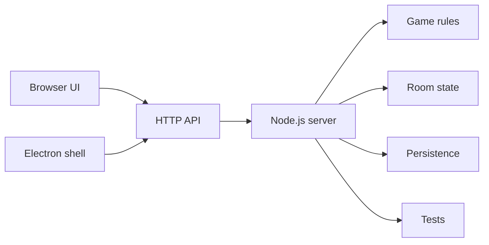

# Черновик пояснительной записки

Тема:

```text
Разработка учебного бизнес-симулятора Biz Arena
```

Автор: Надров Дамир Ильнурович

Организация: Альметьевский филиал КНИТУ-КАИ

Версия проекта: `v0.3.0 Demo Release`

## Введение

Современное обучение предпринимательству и управлению требует не только теоретического объяснения, но и практической модели принятия решений. Бизнес-симулятор позволяет участнику увидеть связь между управленческим действием и экономическим результатом: изменением спроса, выручки, затрат, долговой нагрузки и итогового рейтинга.

Проект Biz Arena разработан как учебный бизнес-симулятор, который можно запустить локально в браузере или в виде настольного Windows-приложения. В демонстрационном сценарии игрок управляет компанией, принимает решения по производству, персоналу, продажам и контрактам, а затем сравнивает результат с конкурентами в рейтинге.

## Актуальность

Актуальность проекта связана с необходимостью доступных учебных инструментов для демонстрации экономических процессов. Полноценные коммерческие бизнес-симуляторы часто требуют внешних серверов, регистрации или длительного сценария. Для учебной защиты и короткой демонстрации удобнее локальное приложение, которое показывает полный цикл за несколько минут.

В основу демонстрационного сценария положена логика чемпионатного формата КАИ: участники регистрируют компанию, принимают решения по периодам, после пересчёта видят экономический результат и сравнивают место в рейтинге. В памятке участнику чемпионата также подчёркивается важность корректного имени компании, контрактов, периодического пересчёта и итогового рейтинга.

## Цель и задачи

Цель работы - разработать учебный бизнес-симулятор Biz Arena для локального показа, тренировочного игрового процесса и демонстрации чемпионатной логики принятия решений.

Для достижения цели были поставлены следующие задачи:

- реализовать создание игровой комнаты и подключение игроков;
- разработать игровой цикл с периодическим пересчётом экономической ситуации;
- добавить производственный сценарий с закупкой компонентов, наймом персонала, сборкой товара и продажами;
- реализовать контракты, рейтинг компаний и экран итогов;
- подготовить демонстрационный сценарий, связанный с форматом КАИ;
- обеспечить запуск в браузере и подготовку к Windows-сборке через Electron;
- добавить автоматические тесты и документацию для защиты.

## Анализ предметной области

Учебные бизнес-симуляторы используются для тренировки управленческого мышления. В них участники видят, что итог зависит не от одного показателя, а от баланса решений: цены, спроса, производства, долговой нагрузки, качества выполнения контрактов и устойчивости компании.

В проекте были рассмотрены следующие ориентиры:

- Simformer и Virtonomics как примеры бизнес-симуляторов с экономической моделью;
- учебные бизнес-чемпионаты, где участники соревнуются в рейтинге;
- памятка участнику чемпионата КАИ как источник демонстрационной логики: имя компании, периоды, пересчёт, контракты, рейтинг и топ-3 победителей.

Biz Arena не является копией существующих систем. Проект выделяет ключевой учебный цикл и делает его доступным для короткой локальной демонстрации.

## Функциональные требования

Приложение должно позволять:

- создать комнату и начать матч;
- запустить готовый демонстрационный матч для защиты;
- выбрать сценарий и сложность;
- управлять производством и продажами;
- работать с контрактами;
- выполнять пересчёт хода;
- просматривать рейтинг компаний;
- завершить матч и увидеть итоговый экран;
- экспортировать результаты в JSON;
- запустить проект в браузере или настольной оболочке.

## Нефункциональные требования

К проекту предъявлялись следующие требования:

- локальный запуск без обязательного внешнего сервера;
- понятный интерфейс для короткой демонстрации;
- поддержка русского, английского и татарского языков;
- возможность упаковки в `.exe`;
- сохранение и восстановление состояния комнаты;
- автоматическая проверка ключевых игровых правил;
- наличие документации для защиты и передачи проекта.

## Архитектура

Biz Arena построена как веб-приложение с серверной игровой логикой.



Клиентская часть находится в папке `public/` и отвечает за интерфейс, локализацию, отображение состояния комнаты и запуск демо-матча. Серверная часть находится в `server.js` и модулях `server/`: она хранит комнаты, рассчитывает игровые правила, обрабатывает действия игроков и отдаёт состояние через API. Настольная оболочка находится в `desktop/` и использует Electron.

## Игровая экономика

В демонстрационном сценарии используется завод мотоциклов. Игрок принимает решения по нескольким направлениям:

- закупка компонентов;
- найм работников;
- сборка готового товара;
- выставление предложения на продажу;
- принятие контрактов;
- контроль денег, долга и рейтинга.

Каждый ход работает как учебный аналог чемпионатного пересчёта. После хода меняется экономическая ситуация: продажи, деньги, долг, статистика производства и положение в рейтинге.

## Чемпионатный сценарий

Основной демонстрационный сценарий называется `KAI Demo Championship`. Он создаётся одной кнопкой `Демо-матч для показа`.

Параметры демо:

- компания игрока: `AFKAIstudent1`;
- сценарий: `motorcycles`;
- сложность: `easy`;
- сезон: 10 ходов;
- соперники: 2 бота;
- матч запускается автоматически;
- начальная вкладка: операции и производство.

Имя `AFKAIstudent1` выбрано по формату из памятки участнику чемпионата, где название компании должно содержать вуз и логин участника.

## Интерфейс и локализация

Интерфейс поддерживает русский, английский и татарский языки. Русский вариант является основным для защиты, английский и татарский оставлены как дополнительные языковые режимы.

В версии `v0.3.0 Demo Release` были доработаны главная страница, экран “О проекте”, кнопка демо-матча и экран итогов. Экран итогов показывает победителя, место игрока, капитал компании, долговой риск, выполненные контракты, исследования, топ-3 рейтинга и краткий вывод для защиты.

## Тестирование

Для проверки проекта используются команды:

```powershell
npm run check
npm test
```

Проверяются синтаксис JavaScript-файлов, игровые правила, жизненный цикл комнаты, API, сохранение и восстановление состояния, сценарии фабрики, сложности и итоговый рейтинг. Также выполнялся ручной smoke test демо-матча: создание комнаты, добавление ботов, запуск матча, пересчёт ходов, проверка рейтинга и экрана итогов.

## Руководство пользователя

Для запуска в браузере:

```powershell
npm start
```

Затем открыть:

```text
http://127.0.0.1:3000
```

Для демонстрации:

1. Открыть главное меню.
2. Перейти в раздел `Играть`.
3. Нажать `Демо-матч для показа`.
4. Показать компанию `AFKAIstudent1`.
5. Показать производство, контракты и рейтинг.
6. Сделать несколько пересчётов хода.
7. Завершить матч или открыть готовый результат.
8. Экспортировать итоговый JSON.

## Заключение

В результате работы был разработан учебный бизнес-симулятор Biz Arena. Проект реализует локальный демонстрационный сценарий, производственную модель, контракты, рейтинг, экран итогов, экспорт результатов и подготовку к настольной Windows-сборке. Документация проекта включает сценарий показа, карту соответствия требованиям чемпионата, структуру презентации, вопросы для защиты и чеклист передачи.

Проект можно использовать как основу для учебной демонстрации, защиты и дальнейшего развития: добавления новых сценариев, расширенной аналитики, учительской панели и более подробных отчётов.

## Приложения

- Карта требований: `docs/championship-requirements-map.md`
- Сценарий показа: `docs/demo-script.md`
- План презентации: `docs/presentation-outline.md`
- Вопросы для защиты: `docs/defense-qa.md`
- JSON-экспорт завершённого демо-матча: `biz-arena-results-*.json`
